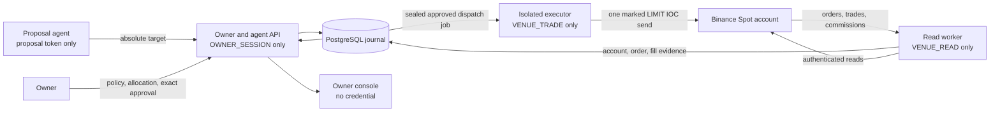

# CapitalDesk architecture and trust boundaries

CapitalDesk coordinates one owner's Spot account without giving proposal agents economic
authority. PostgreSQL is the authority for identities, policy, plans, reservations, dispatch
markers, source evidence, allocations and incidents. Queue messages are hints to re-read that
journal.

The dispatch state, venue order status, accounting completeness and target satisfaction are
separate. A terminal IOC can contain fills; a filled child can leave a net target residual;
an `UNKNOWN` dispatch holds capital. Only terminal order evidence plus complete fills,
commissions and an eligible account cut can release unused reservations.

The executor is the only process allowed to name the trade credential. It receives an exact
approved payload after the dispatch marker is durable. A worker lease does not fence the
venue, so restart never resends an already marked attempt. Proposal text, news, strategy code
and connector output cannot change policy, claims, approval or dispatch authority.

The enabled release scope is one stable account, one environment and epoch, one selected
Spot symbol and sequential `LIMIT IOC` plans. Multi-owner custody, derivatives, transfers,
internal crossing and automatic residual orders are outside this topology.
